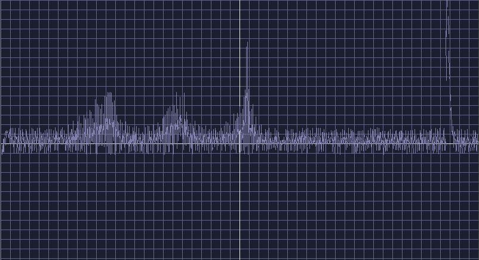

## ArduPlot

[ArduPlot](https://github.com/VP1147/arduplot) is a tool for visualize data from Arduino-connected sensors using [TeenyGraph](https://github.com/VP1147/tg).

### Support or Contact

For any bugs or suggestions, feel free to [open a issue](https://github.com/VP1147/arduplot/issues) and describe it. We'll sure appreciate your help.

